# DF Advogados — Site Institucional

Site institucional moderno e responsivo, desenvolvido para destacar a expertise do escritório em soluções jurídicas eficazes e personalizadas.


---

## 🖥️ Preview

<p align="center">
  
</p>

> **Nota:** O SVG animado percorre automaticamente todas as seções do site — Hero, Sobre, Áreas de Atuação, Diferenciais, Equipe e Contato.

---

## Tecnologias Utilizadas

| Tecnologia | Uso |
| --- | --- |
| **HTML5** | Estrutura semântica com tags `<header>`, `<section>`, `<article>`, `<nav>`, `<footer>` |
| **CSS3** | Estilos modulares com CSS Custom Properties (variáveis), Grid, Flexbox, `@import`, Media Queries |
| **JavaScript ES6+** | Modules (`import`/`export`), IntersectionObserver, FormData API, DOM API |
| **Google Fonts** | Tipografia: Cormorant Garamond (display) + Outfit (body) |
| **BEM** | Metodologia de nomenclatura CSS (`block__element--modifier`) |

---

## Estrutura de Pastas

```
df-advogados/
├── index.html                 # Página principal
├── package.json               # Configuração do projeto
├── README.md                  # Documentação
├── css/
│   ├── styles.css             # Entry point — importa todos os módulos
│   ├── variables.css           # Design tokens e CSS custom properties
│   ├── base.css               # Reset, tipografia base, utilitários
│   ├── components.css         # Botões, seção header, componentes reutilizáveis
│   ├── navbar.css             # Navegação fixa com efeito de scroll
│   ├── hero.css               # Seção hero e barra de estatísticas
│   ├── sections.css           # Sobre, Áreas de Atuação, Diferenciais
│   ├── pages.css              # Equipe, Depoimentos, CTA, Contato, Footer
│   └── responsive.css         # Media queries (1024px, 768px, 480px)
├── js/
│   ├── main.js                # Entry point — inicializa todos os módulos
│   ├── navbar.js              # Efeito scroll da navbar + menu mobile
│   ├── scroll-reveal.js       # Animação de elementos ao scroll
│   ├── smooth-scroll.js       # Rolagem suave para âncoras
│   └── contact-form.js        # Validação e envio do formulário
└── assets/
    └── img/
        ├── logo.jpg           # Logo do escritório
        └── preview.svg        # ← Preview animado (para o README)
```

---

## Como Rodar Localmente

### Opção 1 — Abrir direto no navegador

Basta abrir o arquivo `index.html` no navegador. **Atenção:** Os módulos JS (`type="module"`) exigem que o arquivo seja servido via HTTP. Se abrir diretamente via `file://`, o JavaScript pode não carregar em alguns navegadores.

### Opção 2 — Servidor local com Node.js (recomendado)

```
# Na pasta do projeto:
npx live-server --port=3000 --open
```

Ou:

```
npx http-server -p 3000 -o
```

### Opção 3 — Extensão Live Server (VS Code)

1. Instale a extensão **Live Server** no VS Code.
2. Clique com o botão direito no `index.html` → **Open with Live Server**.

---

## Personalização

### Alterar cores da marca

Edite o arquivo `css/variables.css`:

```
:root {
  --color-teal-deep: #163832;   /* Verde escuro principal */
  --color-gold: #c4a55a;        /* Dourado da marca */
}
```

### Alterar informações de contato

No `index.html`, busque a seção `id="contato"` e atualize:

* Endereço
* Telefone / WhatsApp
* E-mail

### Adicionar advogados

Duplique um bloco `<article class="team-card">` dentro da seção `id="equipe"` e ajuste o nome, cargo e OAB.

### Integrar formulário de contato

No arquivo `js/contact-form.js`, substitua o `setTimeout` da função `handleSubmit` pela chamada real à sua API ou serviço (ex: Formspree, EmailJS, backend próprio).

---

## SEO & Acessibilidade

* Meta tags `<title>`, `<meta description>`, Open Graph
* HTML semântico (`<header>`, `<main>`, `<section>`, `<article>`, `<nav>`, `<footer>`)
* Atributos `aria-label`, `aria-hidden`, `aria-expanded`
* `alt` em imagens, `<label>` com `for` nos inputs
* Contraste de cores adequado (WCAG AA)

---

## Deploy

O site é estático e pode ser hospedado em qualquer serviço:

* **Vercel**: `npx vercel`
* **Netlify**: arraste a pasta no painel
* **GitHub Pages**: suba o repositório e ative nas configurações
* **Hospedagem tradicional**: envie via FTP para a pasta `public_html`

---

## Licença

Projeto privado — DF Advogados. Todos os direitos reservados.
